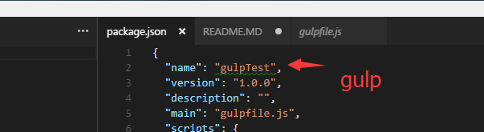

## gulp 工程构建系统

- 注意点：

1. package.json中不能将name字段写为已有的项目名称，否则下载不了这个npm包,如图：


2. 如果指定检测的文件没有变化，第一次编译是不会编译进去的
3. es6语法只有编译好了，才能压缩 


# gulp功能点：

- 编译es6/7语法：
```
安装:
npm i --save-dev babel-plugin-transform-decorators-legacy
npm install --save-dev babel-preset-stage-0
gulp或者webpack中加：
plugins:['transform-decorators-legacy']
presets: ['es2015','stage-0']
```

- 判断js语法错误
> jshint是用来检测javascript的语法错误的


## gulp+angularjs的前端工程解决方案

1. 目录搭建
- 按模块划分（login,order）
- 按功能划分（controller,directive,views...）


