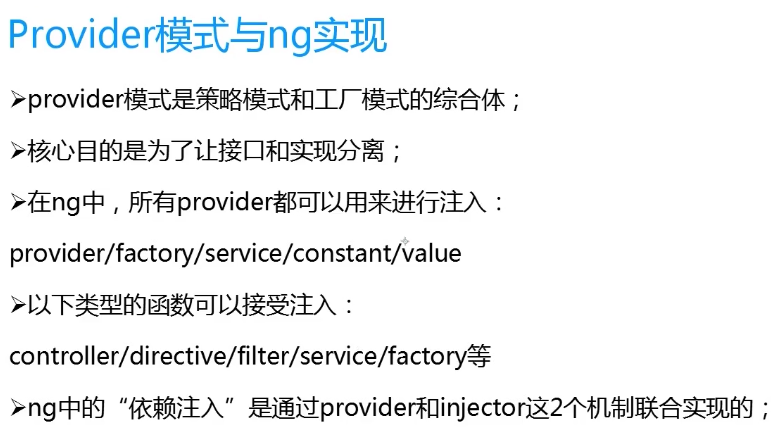

## provider（服务） injector(注射器)

- 注入服务的方式
```
方式一：内联式注入
var m=angular.module('app',[]);
m.controller('appController',['$scope',function($scope){
    }]);

方式二：推断型注入
var m=angular.module('app',[]);
function MyCtrl($scope){

}
m.controller('MyCtrl',MyCtrl);

方式三：声明式注入
var m=angular.module('app',[]);
var MyCtrl=function(thismyname){
    thismyname='jmz'
}

MyCtrl.$inject(['$scope']); 注册服务

m.controller('MyCtrl',MyCtrl); 
```


- 注射器
1. ProviderInjector


2. InstanceInjector


