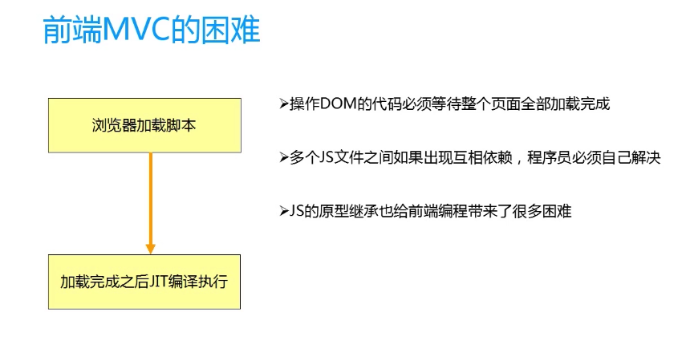

## mvc
1. m    model数据，存，取，但是数据的逻辑处理不在这里；
2. v    viewUI,显示数据，用户交互；
3. c    controller,处理v传过来的数据，放回model,处理model传过来的数据，在view中显示；
- 放代码
- 桥梁  m  <->  c
- 为什么需要mvc?
    1. 代码量太大，需要职责划分开发；模块化；
    2. 模块的复用；不要重复开发；复用；
    3. 后期维护方便；维护；
    4. 总结：mvc只是手段，最终目标为模块化和复用

- 前端实现mvc的难点？


- angular是怎么实现mvc的？
    1. controller
        - 多个controller中通用的部分使用service来实现；
    2. model
        - $scope，视图模型，整个的作用域是树形结构的，$rootScope $scope,跟js的变量取值相同，通过作用域链
        - $scope上的事件，【向上传播 $emit，向下传播 $broadcast】
        - $scope是一个对象，它上面有哪些方法，$watch()/$apply()检测那个数据发生变化
        - $scope会继承父作用域上面的属性和方法；$rootScope
        - 每个angular的应用都只有一个根$scope
        - $scope生命周期
    3. view
        - 复用：使用 directive
总结：angular中的mvc是借助于$scope来实现的；

## 模块化
- 一切都是从模块开始，其他的都是挂在module上
- angular应用程序，将一个应用拆分成若干个模块，进行组合构建一个应用；
- 使用ng-app定义ng应用，可以多个，但是不能嵌套；
- angular对象下的module()方法可以创建一个angular模块
- angular下的模块化的方式：

```angular_module
var an=angular.module('app',[]);
var con=an.controller('app',['$scope',function($scope){
	
}])
```

- ng-controller='con'指定一个视图的控制器
- 一个控制器对应好一个视图和数据（model）
- angular应用基于模块的，每个模块基于mvc的
- angular的模块是一个集合【模型，视图，控制器，服务，过滤器等集合而成】
- 定义多个模块，将控制器，过滤器等定义为多个模块，在一个app.js入口点进行注入；
- 当在多人开发时候，需要将程序的不同视图部分，定义不同控制器，过滤器等多个部分模块开来开发，每个模块再定义控制器，过滤器等；有一个总模块来作为入口；


## 指令系统
- 自定义指令

## 数据双向绑定
- 借助事件机制