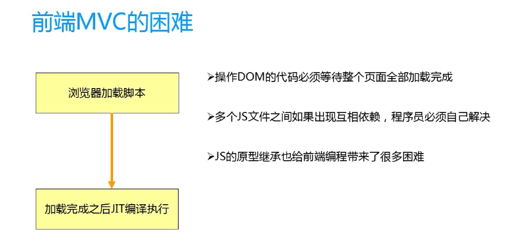

#angular part2

##是什么？
- jquery: 工具库，需要使用一些方法的时候，直接拿来使用
- vue:基于MVVM模式的一个框架，实现了模型，视图的双向绑定，模型与视图通过vue的实例链接起来的；
- angular:基于MVVM模式的一个框架，实现了模型，视图的双向绑定，模型视图通过作用域链接起来；

##一个angular应用
- model viewmodel view controller
1. model:服务中的数据
2. view:html
3. controller中的$scope


## vue与angular
- 定义元素容器
1. vue:el
2. angular:ng-app

##angular与jquery的对比
- jquery操作数据不方便，导致代码比较复杂难维护；
- jquery操作dom,class,id与html,css代码耦合较深；


##mvc
1. m    model数据，存，取，但是数据的逻辑处理不在这里；
2. v    viewUI,显示数据，用户交互；
3. c    controller,处理v传过来的数据，放回model,处理model传过来的数据，在view中显示；
- 放代码
- 桥梁  m  <->  c
- 为什么需要mvc?
    1. 代码量太大，需要职责划分开发；模块化；
    2. 模块的复用；不要重复开发；复用；
    3. 后期维护方便；维护；
    4. 总结：mvc只是手段，最终目标为模块化和复用

- 前端实现mvc的难点？


- angular是怎么实现mvc的？
    1. controller
        - 多个controller中通用的部分使用service来实现；
    2. model
        - $scope
    3. view
        - 复用：使用 directive
总结：angular中的mvc是借助于$scope来实现的；

##控制器定义作用域
- $rootScope：跟作用域；如果在$scope上找不到的变量会向上找$rootScope上的变量
- Scope绑定事件，向下传播以及向上传播
- $scope知识点：


##模块化
- angular应用程序，将一个应用拆分成若干个模块，进行组合构建一个应用；
- 使用ng-app定义ng应用，可以多个，但是不能嵌套；
- angular对象下的module()方法可以创建一个angular模块
- angular.module('app',['$scope',function($scope){}]).controller()
- ng-controller='con'指定一个视图的控制器
- 一个控制器对应好一个视图和数据（model）
- angular应用基于模块的，每个模块基于mvc的
- $scope，视图模型

## 依赖注入


##指令
- ng-value="9-9"：可以写表达式

##内置指令
- 指令拓展html标签的功能；
- ng-class="{red:true,blue:true}"
- ng-include:引入模板
```
 <div ng-include="'header.html'"></div>
```
- ng-switch on ng-switch-then
```
<li ng-repeat="item in items" ng-switch on="item">
            <span ng-switch-when="jmz">{{item}}</span>
        </li>
```

##自定义指令
```
 app.directive('tagName', function() {
            return {
                restrict: "A", //限制指令通过特定的方式来定义
                template: '<h1>这是个自定义的指令</h1>'
            };
        });
```

##数据绑定
- 单项数据绑定
1. 模型绑定到视图上；

- 双项数据绑定
1. 从视图输入操作，反应到model上；

- 数据双项绑定
1. ng-model
2. ng-bind ng-bind-template


##js小技巧

