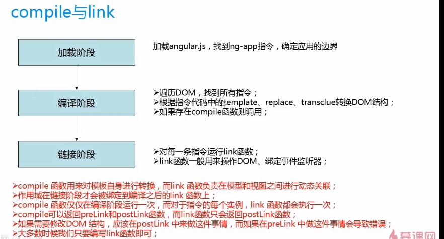
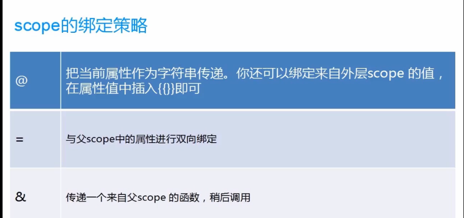

## 指令

### 指令的作用
- 为了拓展原生html的功能，提供更多，更丰富的功能
- 为了封装出独立的公共组件

### angular内置指令
- ng-model="str"          
- ng-bind="str"  
- ng-init="a=0"  			 初始化ng中使用变量
- ng-click="funName"        angular自己的事件
- ng-show="true"
- ng-hide="true"
- ng-clack                  当元素中的数据没有加载过来，元素隐藏
- ng-bind-template ="{{name}}{{age}}"
- ng-value="9-9"：          可以写表达式
- ng-class="{red:true,blue:true}"
- ng-include:引入模板
```
 <div ng-include="'header.html'"></div>
```
- ng-switch on ng-switch-then
```
<li ng-repeat="item in items" ng-switch on="item">
            <span ng-switch-when="jmz">{{item}}</span>
        </li>
```

### 自定义angular指令
```
app.directive('tagName', function() {
            return {
                restrict: "ECAM", //限制指令通过特定的方式来定义
                template: '<h1>这是个自定义的指令</h1>',
                templateUrl:'../index.html',
                replace:true, //阻止指令之间的嵌套
                link:function(){}  //在link函数中操作DOM

            };
});

四种使用方式：（也是内置指令的使用方式）
<tag-name></tag-name>
<div tag-name></div>
<div class="tag-name"></div>
<!-- directive:tag-name -->
<div></div>
```

- 指令一定是可以在不同的controller中复用的
- 所以需要给指令添加不同的配置项来与不同的controller中的scope进行交互


### 指令的运行原理
- link
- compile



### 指令与控制器之间的应用

### 指令之间的应用

### scope的绑定策略
1. @: 只是字符串；
2. =: 绑定后，指令上的数据改变，controller上的数据也会被改变



### 第三方指令库
- angular-ui

### Directive思想的起源与原理概述
