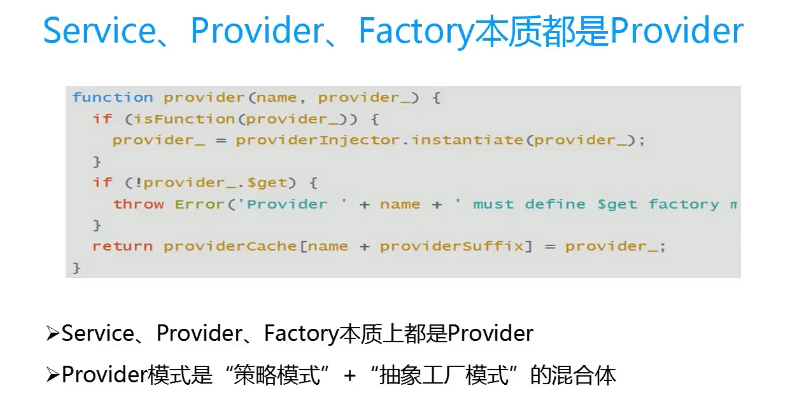

## 自定义依赖注入
1. factory
2. provider
3. service
4. constant 常量
5. value 变量

### Service Provider
    - angular提供的服务Service
    - 自己定义的服务
    ```
    var testMod = angular.module('test', []);

        //依赖注入 
        testMod.factory('serviceTest', ['$http', function($http) {
            return {
                fnInit: function(e) {
                    console.log(e)
                }
            };
        }]);

        // 调用服务
        testMod.controller('testController', ['$scope', 'serviceTest', function($scope, serviceTest) {
            serviceTest.fnInit('这里调用的是我们自己的服务');
        }]);
    ```
    - 第三方的服务

### service factory Providor


1. 自定义provider
```
angular.module('app',[]).providor('name',function(){
   this.$get=function(){
    return {

    }
   } 
    });
```

### service用来干什么？
- 多个controllr公共的方法，定义在service中，相当于react中的minxs
- 每个service都是单例，使用时不需实例化；
- 都是由内部的$injector service来实例化

1. 自定义service
```
angular.module('app',[]).service('name',function(){
    this.a='a'
    });
```

2. $http
    - 使用controller('c',function($scope,$http){})中的$http进行交互
    - $http.get(url,{params:{}}); 返回一个promise对象
    - promise.then(function(res){},function(err){})
    ```
    $http.get('../data/data.json', {
                    params: {
                        a: 'a',
                        responseType:'json'
                    }
                }).then(function(res,status,headers,config) {
                    console.log(res)
                }, function(err,status,headers,config) {
                    console.log(err);
    });

    $http.get('../data/data.json', {
                    params: {
                        a: 'a'
                    },
                    responseType: 'json'
     }).success(function(res) {}).error(function(err) {});
    ```

### $filter
- 自定义filter
 ```
     var testMod = angular.module('test', []);
        testMod.filter('filter1', function() {
            return function(item) {
                return item + 2;
            }
        });
        testMod.controller('testController', function() {

        });
 ```

### constant
- 自定义
```
m.constant('VERSION',{
    A:"A"
    });
```

### value
- 自定义
```
m.value('a',{
        a:'a'
    });
```

### decorator 依赖装饰
```
m.decorator('test',function($delegate){
    $deleget.c=10;
    return $deleget;
    });
```

### 总结：
- 多个控制器注入同一个依赖，依赖内部只执行一次；
- 好处，共享数据


### 数据共享
- controller关系
1. 父子级
2. 无关


